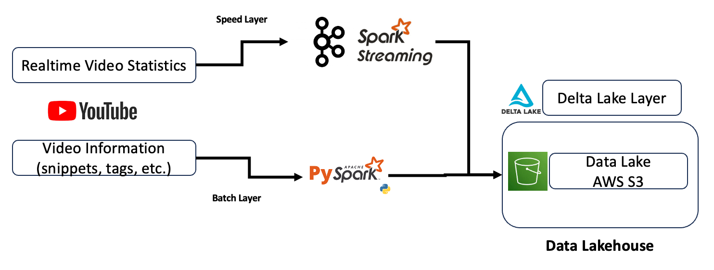

# Data Lakehouse and Lambda Architecture Mini-Project

## Overview
Mini-project to understand and apply simple concepts of the data lakehouse architecture model for data, as well as touching on lambda architecture of keeping speed and batch layers separate. 

Infrastructure was also all self-built, with the exception of baremetal Kubernetes, where minikube was opted instead. 

Does not cover the scopes of a server layer or a frontend. 

## Business Problem 
> Youtube channel data is required - real-time statistics of viewers and likes, as well as historical video metadata and serialization data matching Youtube e-tags and human readable video names. 

## Scenario Flow
0. Set up a minikube cluster to mock an on premise kubernetes setting 
1. Deployed kafka and spark base models simply using helm charts
2. Set up data lakehouse infrastructure using terraform onto AWS S3
3. Created a speed layer to first pull API data and thsen ingest via kafka and spark streaming into S3
4. Created a batch layer to first pull API data and then ingest via spark into S3

## Technologies
- Languags: Python(+Pyspark)
- Frameworks/Services: Kubernetes(Minikube), Kafka, Delta Lake, AWS(S3, IAM), Terraform, Docker

## Data Used
Used YouTube Data API v3 on one of my favorite YouTube channels (@andy_cooks), 
pulled by using Google developer tools. 
- Any Youtube channel can be used as long as the Channel ID is extracted
    - This can be done by looking into the HTML of a Youtube Channel page

## Architecture

## Requirements
- Was built on MacOS with ARM architecture to deploy minikube
    - But a baremetal Kubernetes on VMs (preferrably linux) would also work 
    - Bitnami helm charts were just updated and used at latest for all modules
- Requires an AWS account with IAM permissions and policies to access S3 and matching Key
- Requires a Google developer account with Youtube API enabled (with key)

**E.O.D**
